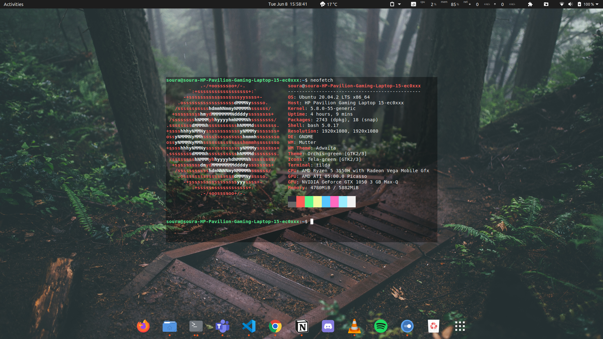
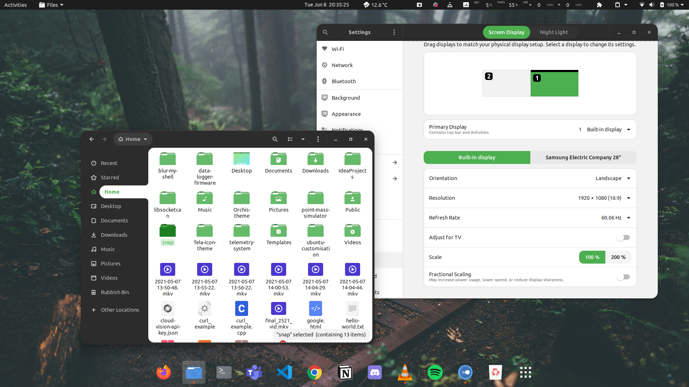
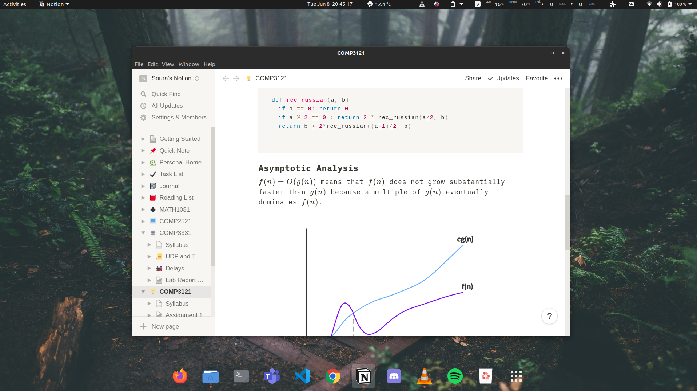

# Ubuntu Customisation - Forest Theme

## Customisation Specifications
* **Operating System**: Ubuntu 20.04.2 LTS x86_64 
* **Shell**: Bash
* **Desktop Environment**: GNOME
* **Window Manager**: Mutter
* **Window Manager Theme**: Adwaita
* **Theme**: Orchis-green [GTK2/3]
* **Icons**: Tela-green [GTK2/3]
* **Terminal**: gnome-terminal / tilda
* **Terminal Theme**: Horizon Dark (Gogh), 20% transparency (gnome-terminal) | Snazzy, 62% transparency (tilda)

## Installed GNOME Extensions
* AppIndicator and KStatusNotifierItem Support
* Bluetooth Quick Connect
* Clipboard Indicator
* Caffeine
* Dash to Dock
* Extension List
* Screenshot Tool
* OpenWeather
* system-monitor

## Installed Apps
* VSCode
* Discord
* Slack
* Microsoft Teams
* Spotify
* VLC Media Player
* Notion Desktop (Lotion)
* FreeCAD
* PulseAudio Volume Control
* OBS Studio
* Shotcut
* FlashForge 3D Print

